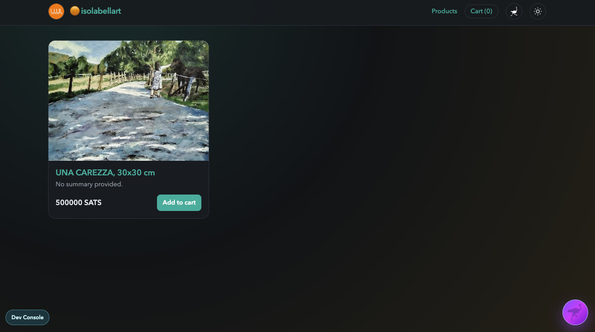

# Gamma Market Webshop



A minimal single-page Nostr webshop built with Nuxt, tailored for NIP-99 product events and the Gamma Market order flow.

## What It Does

- Resolves the merchant from `public/shop-config.json` in local dev and from the Nsite hostname in production.
- Fetches products from the merchant's inbox/outbox relay model using relay discovery.
- Shows a storefront, individual product pages, and a 4-step cart/checkout flow.
- Supports fiat-priced products by converting totals to sats at checkout.
- Submits Gamma-style order events and renders Lightning invoice QR payments.
- Includes a clone-this-nsite flow for both new users and existing Nostr users.

## Core Features

- **Catalog**: latest products section plus full inventory section.
- **Product Pages**: encoded `d`-tag routing with product details, media, specs, and add-to-cart.
- **Checkout**:
  1. shipping/contact input
  2. order review
  3. order submission
  4. Lightning invoice QR
- **Guest / Newcomer Onboarding**: generate a fresh keypair, publish kind `0`, clone site, and open the new Nsite.
- **Existing Nostr Flow**: clone via extension or bunker-based signer flow.
- **Developer Diagnostics**: bottom-left dev console showing merchant npub, relay sets, and runtime details.

## Quick Start

```bash
npm install
npm run dev
```

Local merchant config lives in `public/shop-config.json`.

## Build And Test

```bash
# Static output
npm run generate

# Clone manifest logic checks
npm run test:nsite-clone
```

## Nsite Deploy

This app is designed to work as a static Nsite.

```bash
nsyte deploy ./.output/public --fallback /index.html --sec <nsec>
nsyte status --sec <nsec>
```

Live sites resolve on gateways like:

```bash
https://<npub>.nsite.lol/
```

## Important Files

- `pages/index.vue` - storefront with latest + inventory sections
- `pages/product/[d].vue` - product detail route
- `pages/cart.vue` - 4-step checkout flow
- `composables/useMarketplace.js` - product event parsing/fetching
- `composables/useNostrOrders.js` - order creation/payment lookup
- `composables/useNsiteClone.js` - newcomer clone/profile publish logic
- `components/shop/NsiteCloneFab.vue` - clone UI
- `Skill.md` - rebuild guide for other agents

## Notes

- Product fetching follows merchant relay discovery, not hardcoded operational relays.
- Newcomer cloning publishes a root manifest (`kind:15128`) so the new site resolves correctly on Nsite gateways.
- Nostr branding assets used by the UI are stored locally in `public/nostr-assets/`.

## License

GNU GENERAL PUBLIC LICENSE v3
